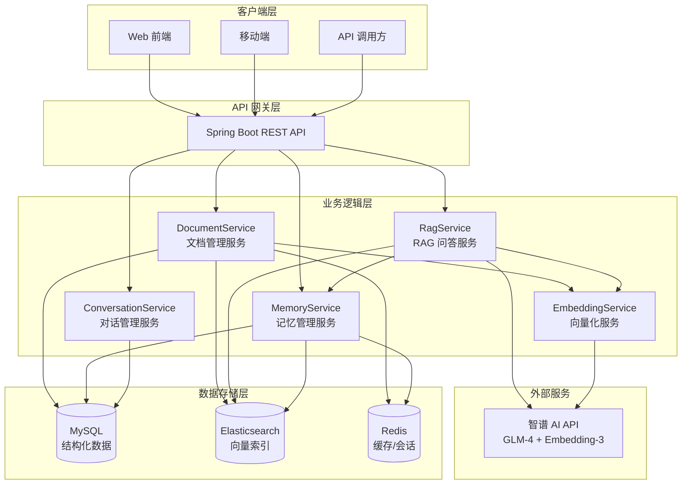
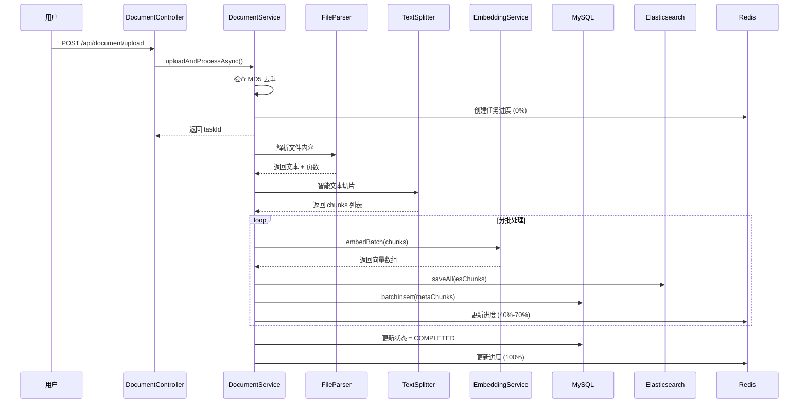
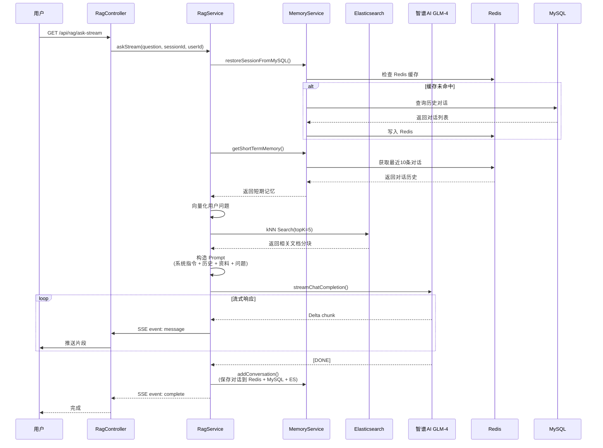
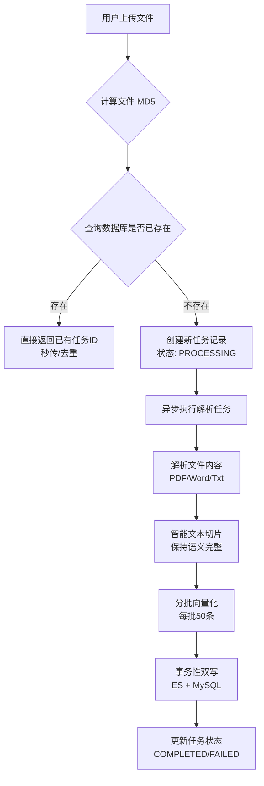

# RAG-KW - 基于 Spring AI 的智能知识库问答系统

[](https://spring.io/projects/spring-boot)
[](LICENSE)

> 🚀 企业级 RAG（检索增强生成）解决方案 | 支持多格式文档解析 | 流式对话 | 三层记忆系统 | 事务一致性保障

[](https://openjdk.java.net/)
---

## 🌟 项目简介

RAG-KW 是一个基于 **Spring AI** 的企业级知识库问答系统，采用 **RAG（Retrieval-Augmented Generation）** 技术架构，能够将私有文档转化为可问答的知识库。

### 核心特性

- ✅ **完整的 RAG Pipeline**：文档上传 → 智能切片 → 向量化 → ES 检索 → LLM 生成
- ✅ **三层记忆系统**：短期记忆（Redis）+ 长期记忆（ES向量摘要）+ 语义记忆（ES知识库）
- ✅ **个性化 RAG**：结合用户历史对话摘要，提供更精准的个性化回答
- ✅ **事务一致性保障**：MySQL + Elasticsearch 双写事务管理，支持手动回滚
- ✅ **异步任务处理**：文件解析、向量化异步执行，支持实时进度追踪
- ✅ **流式响应（SSE）**：基于 Server-Sent Events 的流式对话，提升用户体验
- ✅ **多格式文档支持**：PDF、Word、Excel、TXT 等常见格式
- ✅ **生产级工程化**：环境变量配置、Docker 部署、单元测试覆盖

### 应用场景

- 📚 **企业知识库**：将公司文档、手册转化为可问答的知识库
- 🎓 **智能客服**：基于产品文档自动回答用户问题
- 📖 **个人学习助手**：上传学习资料，快速检索关键信息
- 🔍 **文档搜索引擎**：结合向量检索和全文搜索，提升检索准确率

---

## 📸 效果演示

### 流式对话界面


### 文档上传与进度追踪


### 向量检索结果


---

## 🏗️ 系统架构

### 技术栈

| 分类 | 技术选型 | 版本 | 说明 |
|------|---------|------|------|
| **后端框架** | Spring Boot | 3.3.0 | 核心框架 |
| **ORM** | MyBatis-Plus | 3.5.7 | 数据持久层 |
| **AI 集成** | 智谱 AI SDK | 0.3.3 | LLM + Embedding |
| **向量数据库** | Elasticsearch | 8.13.4 | 向量检索 + 全文搜索 |
| **缓存** | Redis | 7.x | 短期记忆 + 任务进度 |
| **关系数据库** | MySQL | 8.0+ | 结构化数据存储 |
| **文档解析** | Apache PDFBox | 2.0.27 | PDF 解析 |
| **文档解析** | Apache POI | 5.2.5 | Office 文档解析 |
| **JSON 处理** | Fastjson2 | 2.0.40 | JSON 序列化 |

### 架构图

### 数据流转图

#### 文档入库流程


#### RAG 问答流程

---

## 🚀 快速开始

### 环境要求

| 依赖 | 版本 | 必需 | 说明 |
|------|------|------|------|
| JDK | 17+ | ✅ | Java 运行环境 |
| Maven | 3.8+ | ✅ | 构建工具 |
| MySQL | 8.0+ | ✅ | 关系数据库 |
| Elasticsearch | 8.x | ✅ | 向量数据库 |
| Redis | 7.x | ✅ | 缓存服务 |
| Docker | 20.x+ | ⭕ | 可选，用于容器化部署 |

### 安装步骤

#### 1. 克隆项目

```
git clone https://github.com/yourusername/RAG-KW.git 
cd RAG-KW
```
#### 2. 配置环境变量

**Windows:**
```
copy .env.example .env 
notepad .env
```
**Linux/Mac:**
```
cp .env.example .env 
vim .env
```
#### 3. 初始化数据库
```sql
-- 创建数据库 
CREATE DATABASE rag_kw CHARACTER SET utf8mb4 COLLATE utf8mb4_unicode_ci;
-- 切换数据库 
USE rag_kw;
-- 导入表结构（需要先创建 schema.sql 文件） 
SOURCE schema.sql;
```
**数据库表结构：**
- `documents` - 文档元数据表
- `document_chunks_meta` - 文档分块元数据表
- `conversations` - 对话历史表
- `users` - 用户表（可选）

#### 4. 启动依赖服务

**方式一：使用 Docker Compose（推荐）**
```
docker-compose up -d mysql elasticsearch redis
```
**方式二：手动启动**
```
启动 MySQL
docker run -d --name mysql -p 3306:3306 -e MYSQL_ROOT_PASSWORD=yourpassword mysql:8.0
启动 Elasticsearch
docker run -d --name elasticsearch -p 9200:9200 -e "discovery.type=single-node" elasticsearch:8.13.4
启动 Redis
docker run -d --name redis -p 6379:6379 redis:7
```
#### 5. 启动应用

**开发环境（Maven）：**
```
mvn clean spring-boot:run
```

**生产环境（JAR 包）：**
```
mvn clean package -DskipTests 
java -jar target/RAG-KW-0.0.1-SNAPSHOT.jar
```
**使用 Docker（一键启动所有服务）：**
```
docker-compose up -d
```
或执行脚本
```
./start.sh
```

#### 6. 验证启动

访问健康检查接口：
```
curl http://localhost:8080/actuator/health
```
预期响应：
```json
{ "status": "UP" }
```
---
## 🏛️ 核心功能详解

### 1. 智能文档处理 Pipeline

#### 处理流程

#### 关键技术点

**① 基于 MD5 的秒传与去重**
通过计算文件内容的 MD5 哈希值，实现重复文件的快速识别，避免重复解析和向量化，节省存储和算力。

*   **代码位置**: `DocumentService.java` - `uploadAndProcessAsync()`
**② 异步处理与实时进度追踪**
采用 `@Async` 异步处理耗时操作（解析、向量化），并通过 Redis 实时更新任务进度，前端可通过 taskId 轮询获取当前处理状态（如：解析中 30%、向量化中 60%）。

*   **代码位置**: `DocumentService.java` - `processDocumentAsync()` & `updateTaskProgress()`

**③ 跨存储事务一致性保障**
由于数据需要同时写入 Elasticsearch（向量）和 MySQL（元数据），而 ES 不支持 Spring 的 `@Transactional`，因此采用**手动回滚补偿机制**确保数据一致性。

*   **代码位置**: `DocumentService.java` - `saveChunksWithTransaction()`
**④ 失败任务的脏数据清理**
当异步任务执行失败时，自动触发清理逻辑，删除 Redis 进度、MySQL 元数据以及 ES 中可能残留的分块数据，防止垃圾数据堆积。

*   **代码位置**: `DocumentService.java` - `cleanupFailedTask()`

---

### 2. 多层记忆系统

#### 架构设计
为了实现类似人类的记忆机制，系统设计了三层存储结构：

| 记忆类型 | 存储介质 | 生命周期 | 作用 |
| :--- | :--- | :--- | :--- |
| **短期记忆** | Redis | 7天 (TTL) | 维持多轮对话上下文，构造 LLM Prompt |
| **长期记忆** | MySQL | 永久 | 持久化所有对话记录，支持历史回溯与统计 |
| **语义记忆** | Elasticsearch | 永久 | 存储对话摘要向量，支持基于语义的“智能回忆” |

#### 核心逻辑
*   **写入时**：对话产生后，同步写入 Redis 和 MySQL，并异步触发 LLM 生成摘要存入 ES。
*   **读取时**：优先从 Redis 获取最近 10 条对话作为上下文；若 Redis 缺失，则从 MySQL 恢复。

*   **代码位置**: `MemoryService.java` - `addConversation()`
---

### 3. RAG 检索优化

#### 检索流程
1.  **向量化**：使用智谱 `embedding-3` 模型将用户问题转化为 512 维向量。
2.  **kNN 检索**：在 Elasticsearch 中执行向量相似度搜索，召回 TopK 相关分块。
3.  **Prompt 构造**：将检索到的分块内容与短期记忆拼接，注入 System Prompt。
4.  **流式生成**：调用智谱 `glm-4-flash` 模型，通过 SSE 流式返回答案。

#### 关键优化
*   **混合上下文**：Prompt 中不仅包含检索资料，还融入了 Redis 中的历史对话，解决了传统 RAG 无法处理多轮指代的问题。
*   **流式响应 (SSE)**：降低首字延迟（TTFT），提升用户交互体验。

*   **代码位置**: `RagService.java` - `askStream()`
